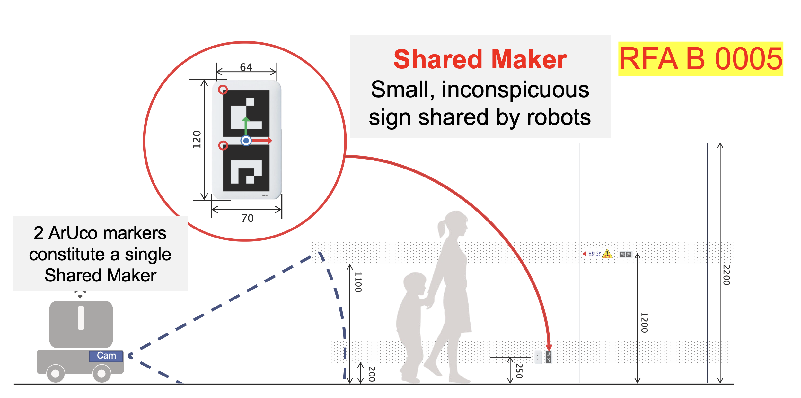

# What is "Shared Marker"？

*Shared Marker* was firstly standardized by [RFA B 0005](https://robot-friendly.org/publication/physical_standard_2026/) published by Robot Friendly Asset Promotion Association (RFA).

Share Marker is a vender-neutoral 2D marker to be shared by multiple and heterogeneous robots in a building.

Its applications are self-locationzation aids, operation commands and/or information tag for robots.

Shared Marker simply consists of two ArUco markers with a layout rule and discrete sizes in order to reduce false positives while ensuring the number of IDs.

Shared Marker ID is defined as "`<ID of the upper ArUco marker>`-`<ID of the lower ArUco marker>`".

The smallest sizes are defined for each application.




# Objective of this repository
This repository is an implementation of *Shared Marker*.

It provides the functions:
- Generation of Shared Marker
- Detection of Shared Marker
- Relative localization of Camera to Shared Marker with the LiDAR integration

# Hardware requirement
- A Camera and a LiDAR are connected with the host PC by USB.
- Camera
  - UVC (USB Video Class)
  - Global shutter (recommended)
- LiDAR (optional)
  - SLAMTEC RPLiDAR
  - S2L is tested but other models may work

# Software requirement
- Python 3.11 or above
  - Core
    - opencv-python 
    - opencv-contrib-python
    - packaging
    - pyyaml
  - Optional
    - pyrplidar
    - pyqtgraph
    - PyQt5

# How to try the demo
## Preparation
- `git clone https://github.com/octarobotics/rfa-shared-marker.git`
- `cd rfa-shared-marker`
- `python -m venv myenv`
- `source myenv/bin/activate`
- `pip install -r requirements.txt`

### Linux (Ubuntu)
- `sudo apt install imagemagick`

### Mac (homebrew)
- `brew install imagemagick`

## Device setting file
- Copy `device_settings_sample.yaml` and customize it for your environment.


## Generation of Shared Marker
- [`shared_marker_generator.py`](src/shared_marker_generator.py) is the script to generate a Shared Marker.
- To simply generate it, run `python src/shared_marker_generator.py <ID of the upper ArUco marker> <ID of the lower ArUco marker>`.
- This script generates the output image in `./image/`
- The size of the generated Shared Marker is 120mm x 70mm (the minimum size for self-localization aid) with 8mm x 8mm cell with 350dpi.
- Please scale it if needed.

## USB Camera test
- [`usb_camera.py`](src/usb_camera.py) is the script to capture images with UVC Camera.
- To test the camera capturing function, run `python src/usb_camera.py <device_settings yaml file>`. 
- A window will open to show captured images. The capturing will be suspended and resumed. See the source code for the detail.

## Camera calibration
- ['camera_calibrator.py'](src/camera_calibrator.py) is the script of camera calibration.
- Print `./resource/charuco.jpg` on A4 sheet to fit the page.
- Run `python src/camera_calibrator.py <device_settings yaml file>` and a window will open.
- Put the ChArUco board in front of the camera.
- On the window, please hit 's' key to use the frame for calibration.
- After 10 valid image are captured, the camera intrinsic parameters matrix and the camera distortion coefficients are calculated and stored into `param_dir` specified in `<device_settings yaml file>`.

## Shared Marker detection test
- [`shared_marker.py`](src/shared_marker.py) is the detector of Shared Marker.
- Run `python src/shared_marker.py <device_settings yaml file>`.
- A window will open to show captured images with detected markers.

## RPLiDAR test
- [`rplidar.py`](src/rplidar.py) is a wrapper script for rplidar.
- Run `python src/rplidar.py <device_settings yaml file>`.
- A window will open to show captured point clouds.

## Relative self-localization test
- [`relative_self_localization_demo.py`](src/relative_self_localization_demo.py) is an example of integration between the camera nad the LiDAR. 
  - This script calculate the relative position and direction of the detected Shared Marker by taking intersection between its elevation and azimuth obtained by the shared marker detector and its neighbor line segment obtained from LiDAR's point clouds.
- Run `python src/relative_self_localization_demo.py <device_settings yaml file>` and a window will open.
- The top frame shows the camera image with notation for the detected ArUco markers.
- The bottom left frame shows the LiDAR points in the LiDAR coordinate system.
- The bottom right frame shows the calculated camera position and direction in the Shared Marker coordinate system.
  - The blue rectangle means the largest Shared Marker, whose normal is indicated with a triangle on the rectangle.
  - The red arrow means the camera position and direction.

>[!NOTE]
> Pose estimation of 2D markers are generally instable when the normal of the marker and the optical axis of the camera are nearly aligned. This effect is particularly noticeable when the marker is far away and appears small.
> 
> To improve this stability, this repository just uses Shared Marker as a clue to determine where to focus in the LiDAR point cloud. Finally, it estimates the position and the normal of the marker based on the point clouds.

# References
```
@InProceedings{citekey,
  author       = "Cota Nabeshima",
  title        = "Standardization of Shared Marker -- New infrastructure for service robots --",
  booktitle    = "Proceedings of The Robotics and Mechatronics Conference 2024 (ROBOMECH2024)",
  year         = "2024",
  number       = "1A1-K05",
  month        = "5",
  address      = "Tochigi",
  note         = "(In Japanese)",
  annote       = ""
}
```